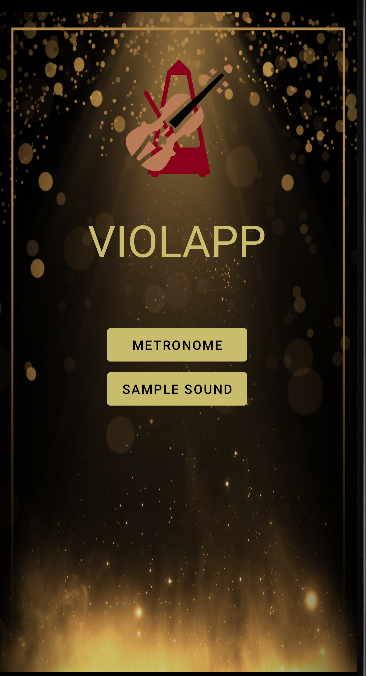

# Violapp
demo link: https://youtu.be/pf6AOCIXx8g
# Introduction
Violapp is an mobile application for musical instrument players.
It has two main features: metronome and violin sample sound.
# Skills gain
* Animation
* Material Design
* Organize UI
* Concurrency using Coroutines
# Portfolio
## Home

## Metronome

## Violin sample sound

