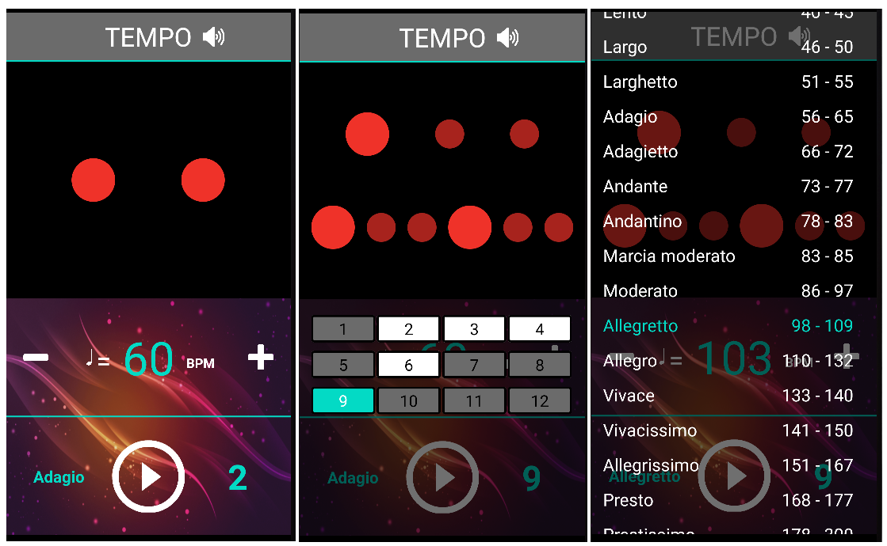

# Violapp
demo link: upcoming
# Introduction
Violapp is an mobile application for musical instrument playera.
It has two main features: metronome and violin sample sound.
Metronome is for practicing rhythm.
Violin sample sound is for ear training exercise.
# Technique uses
* Kotlin
* Coroutines
* MVVM model (architecture component, live data)
* Hilt (dagger 2)
* Navigation component
* Shared Preference
* Animation
* Material Design
* View Binding
# Metronome

# Violin sample sound (developing)
teaser image
